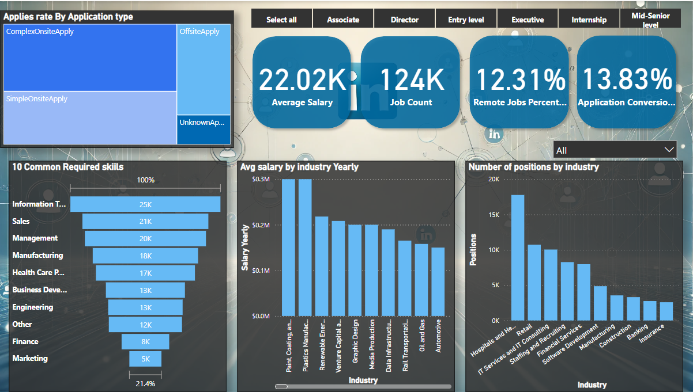
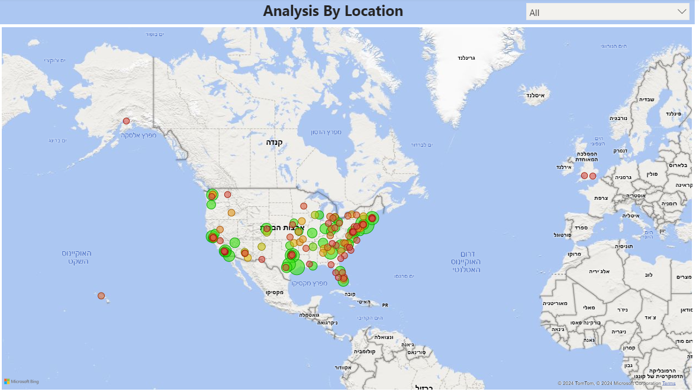

# LinkedIn Job Analysis 📊

**LinkedIn Job Analysis** is a comprehensive project designed to analyze job trends, salaries, required skills, and industry statistics using **SQL** and **Power BI**. The project uses a variety of datasets to create actionable insights for job seekers and employers alike.

---

## 📂 Files Included
- **`Linkedin_Analysis.sql`**: SQL scripts used for data cleaning, manipulation, and aggregation.
- **`benefits.csv`**: Contains data on job benefits across industries.
- **`job_industries.csv`**: Industry-specific job statistics.
- **`job_skills.csv`**: Commonly required skills for each industry.
- **`salaries.csv`**: Data on salaries segmented by industries.
- **`companies.csv`**: Company-wise job statistics.
- **`company_industries.csv`**: Links between companies and their industries.
- **`skills.csv`**: Detailed data on skills and their frequencies.
- **`industries.csv`**: General industry metadata.

---

## 📊 Dashboards Overview
### 1. **Main Analysis Dashbord**

Highlights application conversion rates, remote job percentages, and application types.

### 2. **Geographic Distribution**

Interactive map showing job distributions by location.

---

## 📈 Insights
### 1. **Top Industries**
- The **Hospital and Healthcare** dominate in terms of job openings, with an average of 17,000+ positions.
- **Retail and IT Services/Consulting** industries rank next, with an average of 10000+ positions.

### 2. **Skills in Demand**
- **Top 3 Required Skills**:
  1. Information Technology (25K+ mentions).
  2. Sales (21K mentions).
  3. Management (20K mentions).
- **Emerging Skills**: Engineering and Data Infrastructure are growing in demand.

### 3. **Salary Analysis**
- **Paint Coating and Plastics Manufacturing** lead in yearly average salaries (~$300K).
- Other high-paying industries include **Renewable Energy** and **Venture Capital**.

### 4. **Application Types**
- **Complex Onsite Applications** have the highest rate of successful conversion (~19.10%).
- Remote jobs make up 12.31% of total applications.

### 5. **Geographic Insights**
- The **East Coast of the United States**, especially New York and Washington, shows the highest job density.
- Emerging job hubs: **Texas** and **California**.

---

## 🛠️ How to Use
- Load the SQL file (Linkedin_Analysis.sql) in your preferred database platform.
- Import the datasets into the database.
- Run the queries in Linkedin_Analysis.sql to extract insights.
- Explore the visualizations to gain a deeper understanding of the job market trends.

